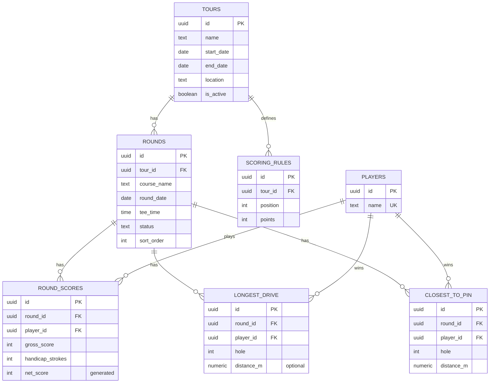

# Mallorca Golf Tour — arkitektur

## 1. Produktarkitektur

```
┌─────────────────────────────────────────────────────────────────┐
│                        Spelarens telefon                        │
│  Next.js App Router (React Server + Client Components)          │
│  ─ localStorage: valt spelarnamn                                 │
│  ─ httpOnly cookie: admin-session (endast om PIN verifierats)    │
└───────────────┬───────────────────────────────┬─────────────────┘
                │ läsning (anon key)             │ Server Actions
                ▼                                ▼
      ┌───────────────────┐            ┌───────────────────────┐
      │ Supabase Postgres  │◄──────────┤ Next.js Server Actions │
      │ RLS: publikt SELECT│  service   │ (körs på Vercel-servern)│
      │ INSERT/UPDATE: nej │  role key  │ verifierar admin-PIN    │
      └─────────┬──────────┘            └───────────────────────┘
                │ postgres_changes (Realtime)
                ▼
      Alla öppna klienter uppdateras automatiskt
```

**Kärnprincip:** ingen inloggning för spelare, men skrivningar är ändå säkra.
Alla `SELECT`-frågor går direkt från webbläsaren till Supabase med den
publika (anon) nyckeln — RLS-policyer tillåter bara läsning. Alla
skrivningar (registrera resultat, skapa rond, osv.) går via Next.js
**Server Actions** som körs på servern, verifierar admin-PIN-cookien, och
skriver med Supabase **service role**-nyckeln, som aldrig når klienten.

## 2. Databasmodell

| Tabell             | Syfte                                                        |
| ------------------ | ------------------------------------------------------------- |
| `players`          | De 4–20 deltagarna. Bara namn — inget konto, inget lösenord.   |
| `tours`            | En golfresa (t.ex. "Mallorca Golf Tour 2026"). En är `is_active`. |
| `rounds`           | En rond: bana, datum, tee time, status (`upcoming`/`completed`). |
| `round_scores`     | En spelares brutto/netto för en rond. `net_score` är en genererad kolumn (`gross - handicap`). |
| `longest_drive`    | En registrering: rond, hål, spelare, längd (valfri).           |
| `closest_to_pin`   | Samma form som ovan, för närmast hål.                          |
| `scoring_rules`    | Poäng per placering för touren (admin-redigerbar).             |

**Beräknade vyer** (aldrig lagrade, kan aldrig hamna i otakt med källdatan):

- `round_scores_ranked` — placering per rond, rankad på nettoscore.
- `round_points` — poäng per spelare/rond, från placering × `scoring_rules`.
- `tour_leaderboard` — totalställning (summa nettoscore över spelade ronder).
- `player_tour_stats` — allt till Statistik-vyn: totalpoäng, vunna ronder,
  LD-/CTP-segrar, snittplacering.

Se [`supabase/migrations/0001_init.sql`](supabase/migrations/0001_init.sql) för
det körbara schemat och [`0002_seed.sql`](supabase/migrations/0002_seed.sql)
för exempeldata som speglar turneringsaffischen.

## 3. ER-diagram



## 4. Admin-läge (PIN) utan konton

1. Admin öppnar `/admin`, matar in PIN-koden på en sifferklaved (samma
   design som wireframen).
2. En Server Action (`verifyPin`) jämför koden mot `ADMIN_PIN` (env-variabel)
   med en tidskonstant jämförelse, och sätter vid rätt kod en signerad,
   `httpOnly`, `secure` cookie (`admin_session`) giltig i 12 timmar.
3. Varje admin-Server Action (`upsertRound`, `saveRoundScores`,
   `recordLongestDrive`, `recordClosestToPin`, `updateScoringRules`) börjar
   med `ensureAdmin()`, som verifierar cookiens signatur och utgångstid
   innan något skrivs — och returnerar ett vanligt felmeddelande (inte ett
   kastat undantag) om sessionen har gått ut, så formuläret kan visa det.
4. PIN-koden och service role-nyckeln lämnar aldrig servern — klienten ser
   bara resultatet av en lyckad/misslyckad inloggning.

## 5. Realtidsfunktioner

Varje sida som visar leaderboard, ronder eller awards renderas först som en
**Server Component** (snabb första laddning, fräsch data). En liten client
component, `RealtimeWatcher`, prenumererar sedan på Supabase Realtime
(`postgres_changes`) för `rounds`, `round_scores`, `longest_drive` och
`closest_to_pin`. Så fort admin sparar ett resultat på sin telefon skickar
Postgres en ändringshändelse, `RealtimeWatcher` fångar den och kör
`router.refresh()` — alla andra spelares telefoner uppdateras automatiskt,
utan att någon behöver dra ner för att uppdatera.

## 6. Projektstruktur

```
mallorca-golf-tour/
├── supabase/migrations/       SQL-schema + seed-data
├── src/
│   ├── app/
│   │   ├── layout.tsx         Root layout, typsnitt, PlayerGate
│   │   ├── globals.css        Designtoken (CSS-variabler), Tailwind-lager
│   │   ├── page.tsx           Namnval (om inget namn valt) / redirect
│   │   ├── dashboard/         Dashboard
│   │   ├── rounds/            Ronder: lista + [roundId]-detalj
│   │   ├── longest-drive/     Longest Drive
│   │   ├── closest-to-pin/    Closest to Pin
│   │   ├── stats/             Statistik
│   │   └── admin/             PIN-lås, panel, formulär (Server Actions i actions.ts)
│   ├── components/            UI-byggklossar (Leaderboard, ScoreTable, PinPad, ...)
│   └── lib/
│       ├── supabase/          Browser-, server- och admin-klienter
│       ├── admin/             PIN-verifiering, sessionscookie
│       ├── types/             Handskrivna databastyper
│       ├── scoring.ts         Ren beräkningslogik (delas av UI och tester)
│       └── player.ts          localStorage-hjälpare för valt namn
└── ARCHITECTURE.md / MVP.md / README.md
```

## 7. Teknikval — motivering

- **Server Components för läsning:** ingen egen API-lada behövs; sidorna
  hämtar direkt från Supabase på servern.
- **Server Actions för skrivning:** slipper egna REST/API-routes för varje
  mutation, och service role-nyckeln kan aldrig läcka till klienten.
- **Vyer istället för lagrad statistik:** totalpoäng, placeringar och
  snittplacering räknas alltid fram från källdatan — omöjligt att de
  hamnar i otakt.
- **Realtime på tabellnivå:** enklast robusta sättet att få "live"-känsla
  utan websockets-kod i appen — Supabase sköter transporten.
